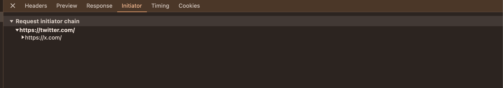
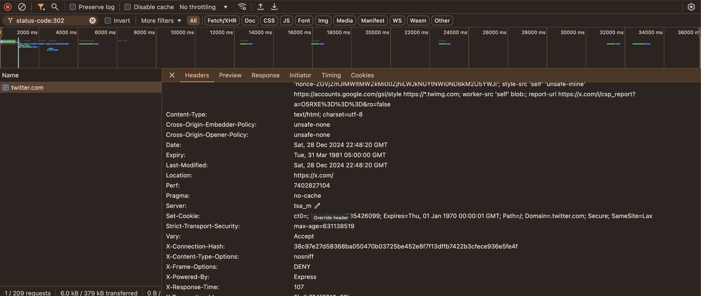

## Introduction

Have you ever wondered how twitter.com redirects to x.com? Let's explore this fascinating process using our browser's network console.

When you visit twitter.com, it first responds with a 302 status code and then redirects to x.com. This process is known as URL forwarding.

## What is URL Forwarding?

URL forwarding refers to the act of redirecting from one URL (e.g., url1.com) to another URL (e.g., url2.com).

[Learn more about HTTP Redirections on MDN Web Docs](https://developer.mozilla.org/en-US/docs/Web/HTTP/Redirections)

## Types of URL Forwarding

### Temporary Forwarding

Temporary forwarding is used during site maintenance or downtime. It uses HTTP code 302.

### Permanent Forwarding

Permanent forwarding uses HTTP code 301. It is used to preserve existing links/bookmarks after changing the site's URLs, progress pages when uploading a file, etc.

## Personal Experience with URL Forwarding

I encountered URL forwarding when setting up x.chintanpuggalok.com to forward to x.com/chintanpuggalok. (DM me if you read this :;)

## How to Set Up URL Forwarding Across Different Domains

Here is how you can set up URL forwarding for different domain registrars:

- **Porkbun**: [How to set up URL forwarding](https://kb.porkbun.com/article/39-how-to-set-up-url-forwarding)
- **Namecheap**: [How to set up a URL redirect for a domain](https://www.namecheap.com/support/knowledgebase/article.aspx/385/2237/how-to-set-up-a-url-redirect-for-a-domain/)
- **Cloudflare**: [How to set up URL forwarding](https://developers.cloudflare.com/rules/page-rules/how-to/url-forwarding/)

## Conclusion

Understanding URL forwarding is crucial for web developers and site administrators. It ensures seamless user experience and preserves SEO value when URLs change. Whether it's temporary or permanent, knowing how to set up URL forwarding can be highly beneficial.
